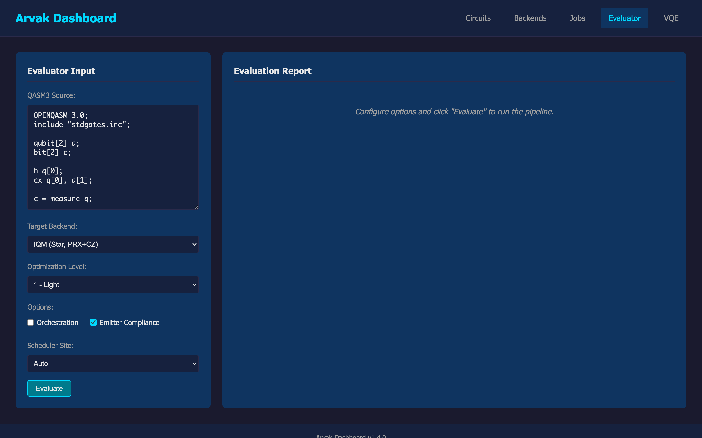
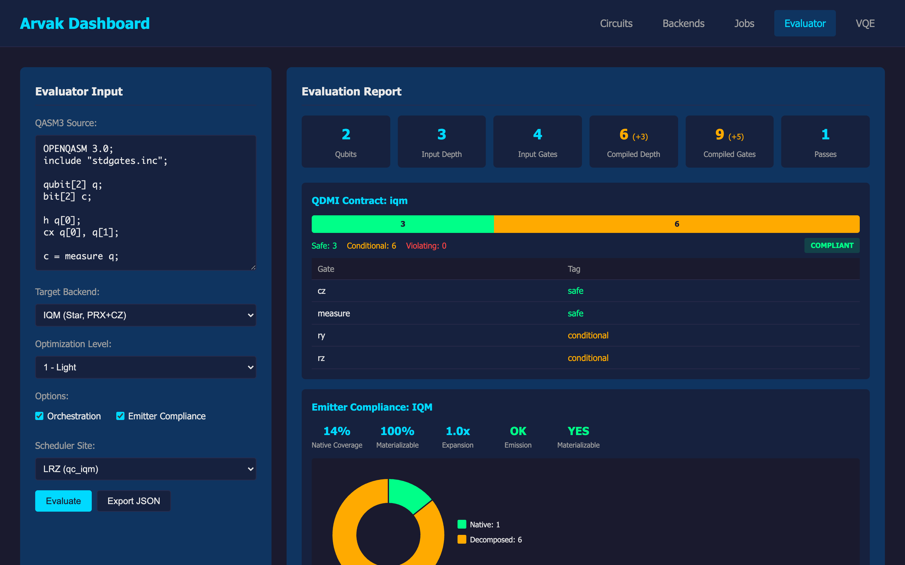
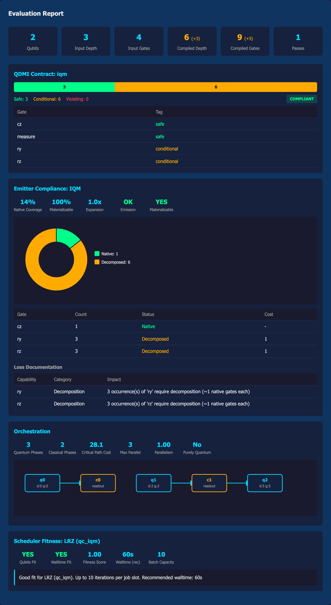

# Arvak Evaluator: Design & Integration Document

**For the MQSS (Munich Quantum Software Stack) Team**

This document describes the design, QDMI integration, and HPC scheduler awareness of `arvak-eval` -- the compiler and orchestration observability module within the Arvak quantum compiler toolkit.

---

## 1. Motivation

The Arvak evaluator exists to answer a concrete question: **"Can this quantum circuit actually run on the target hardware, and what does the compilation pipeline do to it?"**

Current quantum compilation toolchains are largely opaque. A circuit goes in, a compiled circuit comes out, and the user must trust the result. For real HPC deployments targeting IQM devices at LRZ or LUMI, this is insufficient. Operators need to know:

- Whether every gate in the compiled output satisfies the QDMI device contract
- What decomposition overhead the compilation introduces
- Whether the workload fits the scheduler's walltime and qubit constraints
- How the circuit maps to the target's native gate set before emission

`arvak-eval` provides structured, machine-readable answers to all of these.

## 2. Architecture

```text
                    ┌───────────────────────────────────┐
                    │         OpenQASM 3.0 Input         │
                    └───────────────┬───────────────────┘
                                    │
                    ┌───────────────▼───────────────────┐
                    │         Input Analysis             │
                    │  Parse, validate, hash, metrics    │
                    └───────────────┬───────────────────┘
                                    │
                    ┌───────────────▼───────────────────┐
                    │     Compilation Observer           │
                    │  PassManager hooks, per-pass       │
                    │  snapshots, before/after deltas    │
                    └───────────────┬───────────────────┘
                                    │
                    ┌───────────────▼───────────────────┐
                    │     QDMI Contract Checker          │
                    │  Gate-by-gate safety classification│
                    │  against Capabilities (arvak-hal)  │
                    └───────────────┬───────────────────┘
                                    │
                    ┌───────────────▼───────────────────┐
                    │     Orchestration (optional)       │
                    │  Hybrid DAG, critical path,        │
                    │  batchability, scheduler fitness   │
                    └───────────────┬───────────────────┘
                                    │
                    ┌───────────────▼───────────────────┐
                    │    Emitter Compliance (optional)   │
                    │  Native gate mapping, coverage,    │
                    │  decomposition costs, loss docs    │
                    └───────────────┬───────────────────┘
                                    │
                    ┌───────────────▼───────────────────┐
                    │       Metrics Aggregator           │
                    │  Unified deltas across all stages  │
                    └───────────────┬───────────────────┘
                                    │
                    ┌───────────────▼───────────────────┐
                    │         JSON Report (v0.3.0)       │
                    └───────────────┬───────────────────┘
                                    │
                    ┌───────────────▼───────────────────┐
                    │      Arvak Dashboard (Web UI)      │
                    │  Interactive evaluation, D3 charts, │
                    │  summary cards, export to JSON      │
                    └───────────────────────────────────┘
```

## 3. QDMI Contract Checking

### 3.1 Approach

The QDMI contract checker operates on the compiled circuit DAG and the target device's `Capabilities` (from `arvak-hal`). Every operation receives a safety tag:

| Tag | Meaning | QDMI Implication |
|-----|---------|------------------|
| **Safe** | Gate is in the device's native gate set | Direct execution, no overhead |
| **Conditional** | Gate is not native but has a known decomposition | Executable after decomposition; overhead documented |
| **Violating** | Gate cannot be executed or decomposed | Contract violation; circuit cannot run |

A circuit is **compliant** when `violating_count == 0`.

### 3.2 Capabilities Interface

The evaluator uses `arvak-hal::Capabilities` as the device contract source:

```rust
// Factory methods for known devices
let caps = Capabilities::iqm("IQM Garnet", 20);   // PRX, CZ native
let caps = Capabilities::ibm("IBM Eagle", 127);    // SX, RZ, CX native
```

The checker inspects `caps.gate_set.native` for native gates, `caps.gate_set.contains()` for the extended supported set, and falls back to a known-decomposable list for conditional classification.

### 3.3 Gate Classification Logic

```
1. Is the gate in `gate_set.native`?          → Safe
2. Does `gate_set.contains()` return true?    → Safe
3. Is the gate in the known-decomposable set? → Conditional
4. Otherwise                                  → Violating
```

The known-decomposable set covers 30+ standard gates (H, X, Y, Z, S, T, CX, CZ, SWAP, CCX, etc.) with documented decomposition costs in native gate count.

### 3.4 Report Output

```json
{
  "contract": {
    "target_name": "IQM Garnet",
    "target_qubits": 20,
    "safe_count": 12,
    "conditional_count": 3,
    "violating_count": 0,
    "compliant": true,
    "gate_checks": [
      { "gate_name": "prx", "tag": "Safe", "reason": "'prx' is a native gate on IQM Garnet" },
      { "gate_name": "h", "tag": "Conditional", "reason": "'h' is not natively supported but can be decomposed..." }
    ]
  }
}
```

## 4. Emitter Compliance

### 4.1 Purpose

While the QDMI contract checker verifies *logical* gate support, the emitter compliance module checks whether the compiled circuit can actually be *materialized* (emitted) to a specific backend's native instruction set. This closes the gap between "the compiler says it's valid" and "the hardware can execute it."

### 4.2 Supported Targets

| Target | Native Gates | Notes |
|--------|-------------|-------|
| **IQM** | `prx`, `cz`, `id` | IQM Garnet / Helmi native set |
| **IBM** | `sx`, `rz`, `cx`, `id`, `x` | IBM Eagle / Heron basis |
| **CUDA-Q** | 30+ gates (universal) | NVIDIA CUDA-Q simulator |

### 4.3 Materialization Analysis

Every gate in the compiled circuit is classified:

- **Native**: Direct mapping, zero overhead
- **Decomposed**: Requires N native gates (cost documented per gate type)
- **Lost**: No known materialization path

Key metrics produced:

| Metric | Description |
|--------|-------------|
| `native_coverage` | Fraction of gates natively supported (0.0 - 1.0) |
| `materializable_coverage` | Fraction that can be materialized including decomposition |
| `estimated_expansion` | Expected gate count multiplier from decomposition |
| `fully_materializable` | Boolean: are there any lost gates? |

### 4.4 Decomposition Cost Table (excerpt)

| Gate | Cost (native gates) | Notes |
|------|----:|-------|
| H | 3 | Rz + Ry equivalent |
| X, Y, Z | 1 | Single rotation |
| CX | 3 | CZ + H on target |
| SWAP | 3 | 3 CX or 3 CZ + singles |
| CCX (Toffoli) | 15 | Full decomposition |
| CSWAP (Fredkin) | 17 | Full decomposition |

### 4.5 Loss Documentation

When gates require decomposition or are lost, the evaluator produces structured loss records:

```json
{
  "losses": [
    {
      "capability": "h",
      "category": "Decomposition",
      "impact": "2 occurrence(s) of 'h' require decomposition (~3 native gates each)",
      "native_gate_cost": 3
    }
  ]
}
```

Loss categories: `Decomposition` (overhead cost), `Lowering` (abstraction change), `Unsupported` (no materialization path).

### 4.6 QASM3 Emission Verification

The evaluator also attempts actual QASM3 emission via `arvak_qasm3::emit()` to verify round-trip capability. This catches edge cases where the circuit is logically materializable but the emitter fails for structural reasons.

## 5. Orchestration & HPC Scheduler Integration

### 5.1 Hybrid Quantum-Classical DAG

For workloads involving mid-circuit measurement or classical feedback, the evaluator constructs a hybrid DAG:

```text
[quantum_phase_0] ──measurement──> [classical_phase_0] ──parameters──> [quantum_phase_1] ──> ...
```

Each quantum node carries circuit metrics (depth, gate count, estimated cost). Classical nodes carry readout/processing cost. This enables:

- **Critical path analysis**: Longest-cost path through the DAG
- **Batchability analysis**: Independent quantum phases that can run in parallel

### 5.2 Scheduler Constraints

The evaluator models constraints for two HPC sites:

| Parameter | LRZ | LUMI |
|-----------|-----|------|
| **Site** | Leibniz Rechenzentrum | CSC Finland |
| **Scheduler** | SLURM | SLURM |
| **Partition** | `qc_iqm` | `q_fiqci` |
| **Max Walltime** | 3600s (1 hour) | 900s (15 minutes) |
| **Max Qubits** | 20 | 5 (Helmi) |
| **Max Batch Jobs** | 10 | 5 |
| **Array Jobs** | Yes | Yes |
| **Typical Queue Wait** | ~120s | ~60s |

### 5.3 Fitness Scoring

The scheduler fitness evaluator produces:

| Output | Description |
|--------|-------------|
| `qubits_fit` | Whether the circuit's qubit count fits the device |
| `fits_walltime` | Whether estimated runtime fits the walltime limit |
| `batch_capacity` | Number of circuit executions per walltime slot |
| `recommended_walltime` | Suggested `--time` value for `sbatch` (with 2x safety margin) |
| `fitness_score` | 0.0 (incompatible) to 1.0 (perfect fit) |
| `assessment` | Human-readable fitness assessment |

Walltime estimation model:
- Gate time: `depth * 1 microsecond`
- Compilation overhead: 5 seconds
- Setup/calibration: 10 seconds
- Readout (1024 shots): 1 second

### 5.4 Example Scheduler Output

```json
{
  "scheduler": {
    "constraints": { "site": "LRZ", "partition": "qc_iqm", "max_qubits": 20 },
    "walltime": { "total_seconds": 16.0, "fits_walltime": true, "recommended_walltime": 60, "batch_capacity": 10 },
    "qubits_fit": true,
    "fitness_score": 0.90,
    "assessment": "Good fit for LRZ (qc_iqm). Up to 10 iterations per job slot. Recommended walltime: 60s"
  }
}
```

## 6. Compilation Observation

The evaluator wraps the Arvak `PassManager` and records snapshots before and after each compilation pass:

- **Per-pass records**: Gate count, depth, two-qubit gate count at each stage
- **Initial/final snapshots**: Full structural metrics before and after compilation
- **Compilation effect**: Depth delta, ops delta, two-qubit gate delta (with ratios)

This is independent of the QDMI contract -- it observes what the compiler *does* rather than what the hardware *requires*.

## 7. Metrics Aggregation

The `MetricsAggregator` unifies data from all modules into a single metrics section:

```json
{
  "metrics": {
    "compilation_effect": {
      "depth_delta": -2, "depth_ratio": 0.6,
      "ops_delta": -3, "ops_ratio": 0.7,
      "two_qubit_delta": 0, "two_qubit_ratio": 1.0
    },
    "compliance": {
      "compliant": true, "safe_fraction": 0.8, "conditional_fraction": 0.2
    },
    "orchestration_effect": {
      "quantum_phases": 2, "critical_path_cost": 25.0,
      "max_parallel_quantum": 1, "scheduler_fitness": 0.9
    },
    "emitter_effect": {
      "target": "IQM", "native_coverage": 0.6,
      "materializable_coverage": 1.0, "estimated_expansion": 2.1,
      "fully_materializable": true
    }
  }
}
```

## 8. Dashboard Integration

The Arvak Dashboard (`arvak-dashboard`) provides an interactive web interface for the evaluator at `/app/`. This exposes the full evaluation pipeline through a browser-based UI, complementing the CLI and programmatic interfaces.

### 8.1 Evaluator View

The dashboard's **Evaluator** tab provides a two-panel layout: an input panel on the left and a results panel on the right.

**Input panel** — users configure:

- **QASM3 Source**: Inline editor with a default Bell state circuit
- **Target Backend**: IQM (Star, PRX+CZ), IBM (Linear, SX+RZ+CX), or Simulator (Universal)
- **Optimization Level**: 0 (None) through 3 (Heavy)
- **Orchestration**: Toggle for hybrid quantum-classical DAG analysis
- **Emitter Compliance**: Toggle for backend-specific materialization analysis
- **Scheduler Site**: Auto, LRZ (qc_iqm), or LUMI (q_fiqci)


*The Evaluator input panel with QASM3 editor, target backend selector, and evaluation options.*

### 8.2 Evaluation Report

After clicking **Evaluate**, the results panel renders the full report with interactive visualizations:


*Evaluation results for a Bell state circuit compiled for IQM with orchestration and LRZ scheduler enabled.*

**Summary cards** — at-a-glance metrics for qubits, input/compiled depth and gate count (with deltas), and number of compiler passes applied.

**QDMI Contract** — a stacked compliance bar showing safe (green), conditional (yellow), and violating (red) gate counts, with a COMPLIANT/NON-COMPLIANT badge. A gate-by-gate table below lists each operation and its safety classification.

**Emitter Compliance** — coverage metrics (native coverage, materializable coverage, expansion factor, emission status) and a D3 donut chart showing the native vs. decomposed gate ratio. Includes a gate materialization table with per-gate costs and a loss documentation table.

**Orchestration** — quantum/classical phase counts, critical path cost, parallelism metrics, and an interactive D3 hybrid DAG visualization showing the quantum-classical phase graph with node-to-node dependencies.

**Scheduler Fitness** — qubit fit, walltime fit, fitness score, recommended walltime, batch capacity, and a human-readable assessment.


*The complete evaluation report with all sections: summary, QDMI contract, emitter compliance with donut chart, orchestration with hybrid DAG, and scheduler fitness.*

### 8.3 API Endpoint

The dashboard communicates with the evaluator through a REST endpoint:

```
POST /api/eval
Content-Type: application/json

{
    "qasm": "OPENQASM 3.0; ...",
    "target": "iqm",
    "optimization_level": 1,
    "target_qubits": 20,
    "orchestration": true,
    "scheduler_site": "lrz",
    "emit_target": "iqm"
}
```

The response is the same JSON report described in Section 10, consumed directly by the dashboard's rendering logic.

### 8.4 Export

The **Export JSON** button (visible after evaluation) allows downloading the raw JSON report for archival, CI integration, or further processing.

## 9. Benchmark Reference Workloads

The evaluator includes a non-normative benchmark loader for standard circuit families:

| Suite | Description | Gate Pattern |
|-------|-------------|-------------|
| **GHZ** | Greenberger-Horne-Zeilinger state | H + (n-1) CX chain |
| **QFT** | Quantum Fourier Transform | H, controlled-phase, SWAP |
| **Grover** | Grover's search (single iteration) | H, X, oracle, diffusion |
| **Random** | Random single-qubit + CX layers | Pseudo-random gate selection |

Benchmarks are generated as `arvak-ir` circuits and emitted to QASM3. They are labeled "non-normative" -- they provide a reference workload, not a performance claim.

## 10. JSON Report Schema

The report uses schema version `0.3.0`. All fields are present in every report; optional sections (`orchestration`, `scheduler`, `emitter`, `benchmark`) are omitted from JSON serialization when their corresponding CLI flags are not used, via `#[serde(skip_serializing_if = "Option::is_none")]`.

Top-level structure:

| Field | Type | Always Present |
|-------|------|:-:|
| `schema_version` | String | Yes |
| `timestamp` | ISO 8601 | Yes |
| `profile` | String | Yes |
| `input` | InputReport | Yes |
| `compilation` | CompilationReport | Yes |
| `contract` | ContractReport | Yes |
| `metrics` | AggregatedMetrics | Yes |
| `orchestration` | OrchestrationReport | No |
| `scheduler` | SchedulerFitness | No |
| `emitter` | EmitterReport | No |
| `benchmark` | BenchmarkCircuit | No |
| `reproducibility` | ReproducibilityInfo | Yes |

## 11. Integration with the MQSS

### 11.1 QDMI Alignment

The contract checker's safety classification directly maps to QDMI concepts:

- **Safe** gates correspond to operations within the device's advertised QDMI capability set
- **Conditional** gates are outside the native set but decomposable -- this is the compilation pipeline's responsibility
- **Violating** gates represent a contract breach that should be caught before submission

The `Capabilities` struct (from `arvak-hal`) serves as the QDMI contract source. Its factory methods (`Capabilities::iqm()`, `Capabilities::ibm()`) encode device-specific gate sets, qubit counts, and feature flags.

### 11.2 LRZ/LUMI Deployment

The scheduler context module directly models LRZ's `qc_iqm` and LUMI's `q_fiqci` partitions. The fitness assessment can be used to:

1. **Pre-screen workloads** before SLURM submission
2. **Auto-generate `sbatch` parameters** from the recommended walltime
3. **Estimate batch capacity** for variational algorithm iterations (VQE, QAOA)
4. **Flag incompatible workloads** (too many qubits, exceeds walltime)

### 11.3 IQM Backend Integration

The emitter compliance module specifically models the IQM native gate set (PRX, CZ). When compiling for IQM targets, the evaluator can report:

- Which compiled gates are already in the IQM native basis
- Which require decomposition (with exact native gate cost)
- Whether the compiled circuit can be emitted to QASM3 for IQM submission
- The expected gate expansion factor (important for noise budget estimation)

### 11.4 Suggested Workflow

**Option A: CLI**

```
Developer writes QASM3 circuit
    |
    v
arvak eval --input circuit.qasm3 --target iqm --orchestration --emit iqm --scheduler-site lrz
    |
    v
Review JSON report:
  - Contract compliant? (no violating gates)
  - Emitter materializable? (no lost gates)
  - Scheduler fit? (qubits fit, walltime ok)
  - Decomposition overhead acceptable? (expansion factor)
    |
    v
If OK: submit to LRZ SLURM with recommended walltime
If not: adjust circuit or compilation settings
```

**Option B: Dashboard**

```
Open Arvak Dashboard at /app/
    |
    v
Navigate to Evaluator tab → paste QASM3 → select target, opt level, options
    |
    v
Click "Evaluate" → review interactive report:
  - Summary cards: qubit count, depth/gate deltas
  - QDMI compliance bar: safe/conditional/violating breakdown
  - Emitter donut chart: native vs. decomposed gate ratio
  - Orchestration DAG: quantum-classical phase dependencies
  - Scheduler fitness: walltime, batch capacity, assessment
    |
    v
If OK: export JSON for submission pipeline
If not: adjust circuit in the editor and re-evaluate
```

The dashboard is particularly useful for rapid iteration and visual inspection, while the CLI is better suited for automation and CI/CD pipelines.

## 12. Reproducibility

Every report includes:

- **Arvak version**: Crate version at evaluation time
- **CLI arguments**: Exact command line used (for re-running)
- **Content hash**: SHA-256 of the input QASM3 source
- **Timestamp**: UTC time of evaluation

This ensures any report can be traced back to its exact inputs and toolchain version.

## 13. Current Status

- **Schema version**: 0.3.0
- **Test coverage**: 62 unit and integration tests
- **Targets**: IQM, IBM, CUDA-Q / simulator
- **Scheduler models**: LRZ (`qc_iqm`), LUMI (`q_fiqci`), local simulator
- **Benchmark suites**: GHZ, QFT, Grover, Random
- **Dashboard**: Interactive Evaluator view with D3 visualizations, deployed at `arvak.io/app/`

## 14. Future Directions

- **Live QDMI queries**: Replace static `Capabilities` with runtime QDMI device queries
- **Noise-aware evaluation**: Integrate error rates from QDMI properties into fitness scoring
- **Multi-device orchestration**: Scheduler-aware splitting across multiple quantum backends
- **Variational workload profiling**: Iteration count estimation for VQE/QAOA with scheduler batch limits
- **CI/CD integration**: Pre-merge contract validation for quantum circuit repositories
